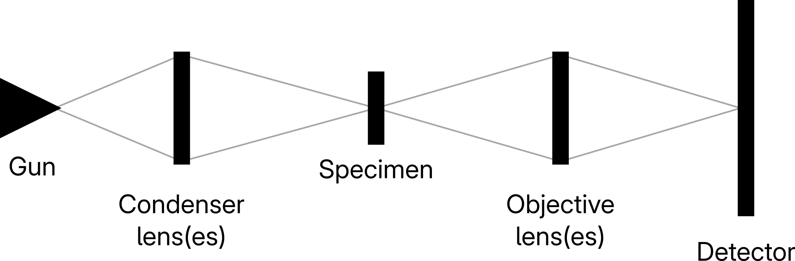
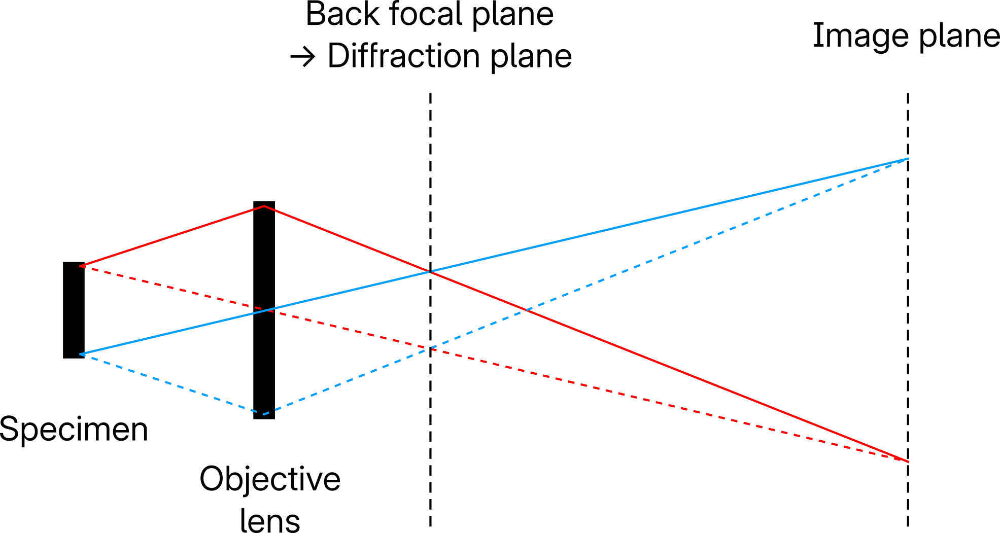
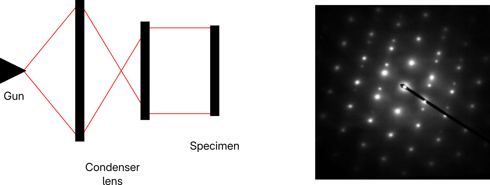
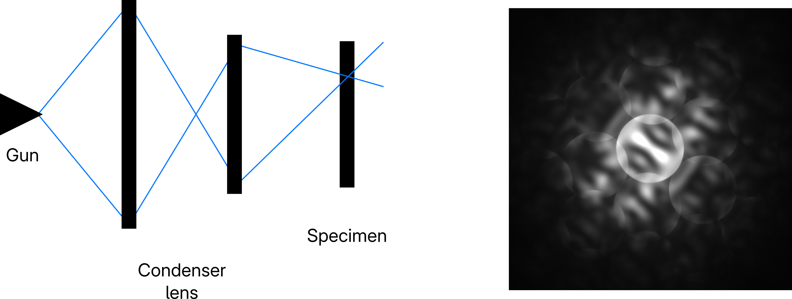

<!-- _class: title -->
<!-- _paginate: false -->
<!-- _header: "" -->

# STEM basics

Intern study, week 1

2026.09.19
정수영

---

### Scope

I will focus on the **formation of a (S)TEM image**

- Geometry of (S)TEM

- Electron-sample interaction

- Information on the detector

 

I will not cover how to *practically obtain* a high-resolution image:

Electron guns, Aberration correction, Ronchigrams, Kikuchi lines,...

 

> Lower-resolution techniques lead to higher-resolution techniques.

---

### Model (S)TEM

 

---

### (S)TEM Geometry: Image plane

 

 

The wave at the image plane is (ideally) identical to the exit wave of the specimen

---

### (S)TEM Geometry: Diffraction plane

 

 

Back focal plane = Image plane of infinity

-> Fraunhofer (far-field) diffraction = Fourier transform = Reciprocal space!

---

### (S)TEM Geometry: Parallel illumination

 

 

Parallel beams create spot patterns -> Selected Area Diffraction Pattern (SADP)

<!-- _footer: Zone Axis Diffraciton Pattern of Twinned Austenite in Steel. From https://commons.wikimedia.org/wiki/File:Austenite_ZADP.jpg.
 -->

---

### (S)TEM Geometry: Convergent beam illumination

 

 

Convergent beams create "Bragg discs" -> Convergent Beam Electron Diffraction (CBED)

Bragg discs: projections of the probe aperture

<!-- _footer: CBED pattern of GaN/InGaN. From https://www.gatan.com/resources/media-library/110-cbed-pattern-ganingan-0?modal=1 -->

---

### TEM imaging

---

### STEM imaging

    - 1 pixel / probe position
    - screen does not contain image; instead it contains rich information of that specific probe position
    - spacial fidelity of probe is very high
    - 2 displays: 1 for beam and 1 for scanned "image"

---

### What is an exit wave?

---

### Thin sample: the 'phase object'

---

### Scattered electrons

---

### 

---
